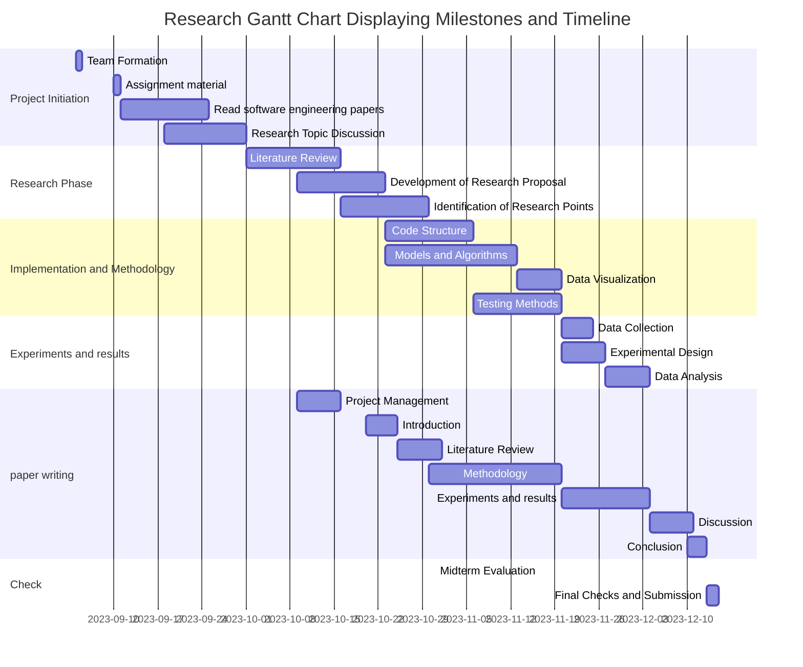

# pyHeatTrace
Easily analyze Python program function execution with heatmaps generated via tracing.

### Gantt Chart

```mermaid
gantt
    title Research Gantt Chart Displaying Milestones and Timeline
    dateFormat  YYYY-MM-DD

    section Project Initiation
    Team Formation: 2023-09-04, 2023-09-05
    Assignment material: 2023-09-10, 2023-09-11
    Read software engineering papers: 2023-09-11, 2023-09-25
    Research Topic Discussion: 2023-09-18, 2023-10-01
    
    section Research Phase
    Literature Review: 2023-10-01, 2023-10-16
    Development of Research Proposal:2023-10-09, 2023-10-23
    Identification of Research Points: 2023-10-16, 2023-10-30

    section Implementation and Methodology
    Code Structure: 2023-10-23, 2023-11-06
    Models and Algorithms: 2023-10-23, 2023-11-13
    Data Visualization:2023-11-13,2023-11-20
    Testing Methods: 2023-11-06, 2023-11-20

    section Experiments and results
    Data Collection: 2023-11-20, 5d
    Experimental Design: 2023-11-20, 2023-11-27
    Data Analysis:2023-11-27, 2023-12-04

    section paper writing
    Project Management: 2023.10.09, 7d
    Introduction: 2023-10-20, 5d
    Literature Review: 2023-10.25,7d
    Methodology: 2023-10.30,2023-11-20
    Experiments and results: 2023-11-20,2023-12-04
    Discussion:2023-12-04,2023-12-11
    Conclusion:2023-12-10,2023-12-13

    section Check
    Midterm Evaluation: 2023-10-31, 2023-11-1
    Final Checks and Submission: 2023-12-13, 2023-12-15
```

